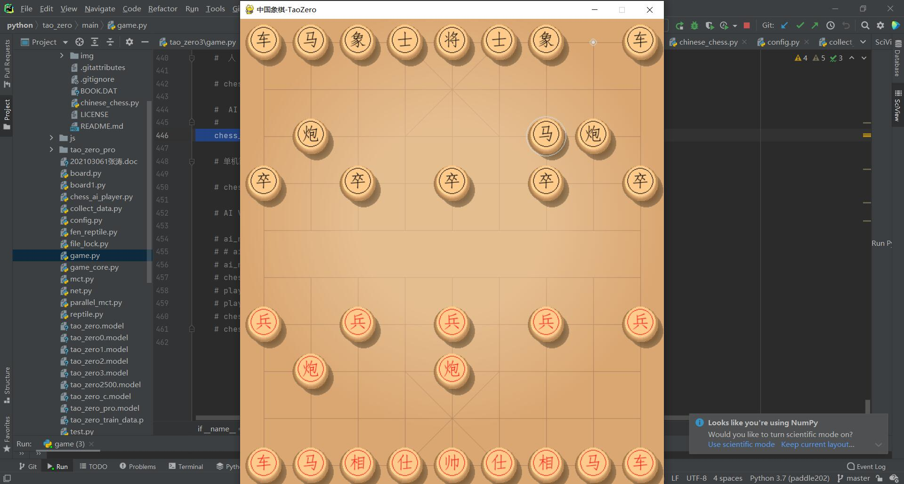
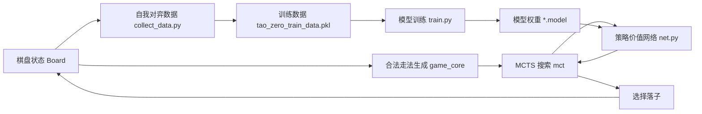

# ChineseChessAI


基于 **PaddlePaddle + Monte Carlo Tree Search** 的中国象棋 AI 项目，包含棋盘渲染、规则逻辑、MCTS 搜索、神经网络策略价值模型、自我对弈数据采集和模型训练流程。
## 演示视频

[演示视频](https://tt-music-1316659401.cos.ap-shanghai.myqcloud.com/mp4/6%E6%9C%8825%E6%97%A5.mp4)

## 运行截图



## 目录

- [项目结构](#项目结构)
- [核心流程](#核心流程)
- [环境依赖](#环境依赖)
- [快速运行](#快速运行)
- [训练与数据](#训练与数据)
- [模型文件](#模型文件)
- [注意事项](#注意事项)

## 项目结构

```text
ChineseChessAI/
├─ font/                         # 棋盘字体资源
├─ sound/                        # 走子、吃子、将军等音效
├─ main/
│  ├─ game.py                    # 游戏主入口
│  ├─ board.py                   # 棋盘状态与 pygame 渲染
│  ├─ game_core.py               # 中国象棋规则与动作映射
│  ├─ mct.py                     # MCTS 搜索玩家
│  ├─ parallel_mct.py            # 并行 MCTS 实现
│  ├─ net.py                     # PaddlePaddle 策略价值网络
│  ├─ train.py                   # 模型训练入口
│  ├─ collect_data.py            # 自我对弈数据采集
│  ├─ reptile.py                 # 棋谱/局面数据抓取
│  ├─ fen_reptile.py             # FEN 局面数据抓取
│  ├─ tao_zero_pro/              # Pro 版本训练与网络代码
│  └─ chinese_chess_main/        # 传统 pygame 象棋 AI 示例
└─ README.md
```

## 核心流程



## 环境依赖

| 依赖 | 用途 |
| --- | --- |
| `paddlepaddle` | 策略价值网络训练与推理 |
| `pygame` | 棋盘窗口、棋子绘制和音效播放 |
| `numpy` | 棋盘状态、概率分布和训练数据处理 |
| `requests` | Web AI 与数据抓取请求 |
| `beautifulsoup4` | 棋谱页面解析 |
| `git-lfs` | 管理超过 GitHub 普通文件限制的模型权重 |

建议使用虚拟环境安装依赖：

```bash
python -m venv .venv
source .venv/bin/activate
pip install paddlepaddle pygame numpy requests beautifulsoup4
```

Windows PowerShell 可使用：

```powershell
python -m venv .venv
.\.venv\Scripts\Activate.ps1
pip install paddlepaddle pygame numpy requests beautifulsoup4
```

## 快速运行

进入主程序目录后启动游戏：

```bash
cd main
python game.py
```

默认入口位于 `main/game.py`，可以在文件底部切换不同模式：

| 模式 | 调用方式 |
| --- | --- |
| 人机对战 | `chess_game.start_with_renderer()` |
| 本地简易 AI 对战 | `chess_game.start_with_local_ai()` |
| 人人对战 | `chess_game.start_people_with_people()` |
| AI 自我对弈训练 | `chess_game.start_training_no_renderer(...)` |
| Web AI 辅助训练 | `chess_game.start_training_with_web_ai(...)` |

## 训练与数据

训练配置集中在 `main/config.py`：

| 参数 | 说明 |
| --- | --- |
| `search_num` | 每步 MCTS 模拟次数 |
| `buffer_size` | 经验池大小 |
| `model_path` | 当前模型权重文件 |
| `train_data_path` | 训练数据文件 |
| `batch_size` | 每次训练批大小 |
| `epochs` | 单轮更新次数 |
| `game_batch_num` | 训练循环次数 |

训练入口：

```bash
cd main
python train.py
```

数据采集入口：

```bash
cd main
python collect_data.py
```

## 模型文件

项目包含多个已经训练或中间保存的模型文件：

| 文件 | 说明 |
| --- | --- |
| `main/tao_zero.model` | 基础模型 |
| `main/tao_zero0.model` - `main/tao_zero3.model` | 不同训练阶段模型 |
| `main/tao_zero2500.model` | 训练到指定批次的模型 |
| `main/tao_zero_c.model` | 当前配置默认模型 |
| `main/tao_zero_pro.model` | Pro 版本模型 |

这些 `.model` 文件单个约 100 MB，已经通过 **Git LFS** 管理。克隆仓库后如需完整模型文件，请先安装 Git LFS：

```bash
git lfs install
git clone https://github.com/19continue/ChineseChessAI.git
```

## 注意事项

| 项目 | 说明 |
| --- | --- |
| 字符编码 | 部分历史源码注释可能存在编码显示问题，不影响核心代码结构上传 |
| 训练平台 | `main/file_lock.py` 使用 `fcntl`，完整训练流程更适合 Linux/WSL 环境 |
| 大文件 | 模型权重通过 Git LFS 上传，普通 GitHub 文件限制不会阻塞 `.model` 文件 |
| 网络接口 | Web AI 与棋谱抓取依赖外部站点，请根据实际网络情况调整请求间隔 |

## License

子目录 `main/chinese_chess_main/` 中保留了原示例项目的 `LICENSE` 文件。根项目如需统一开源协议，可后续补充顶层 `LICENSE`。
